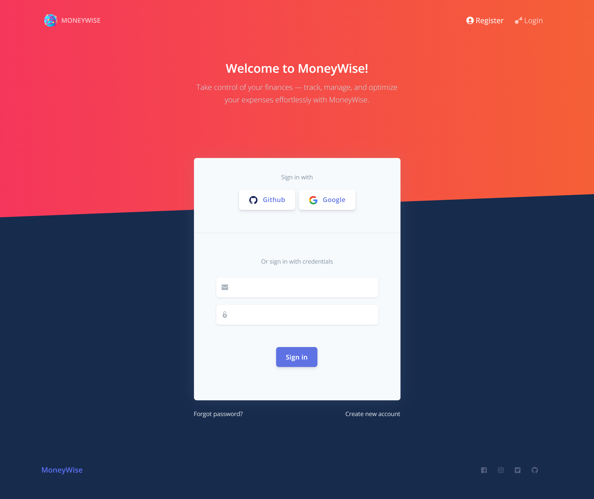
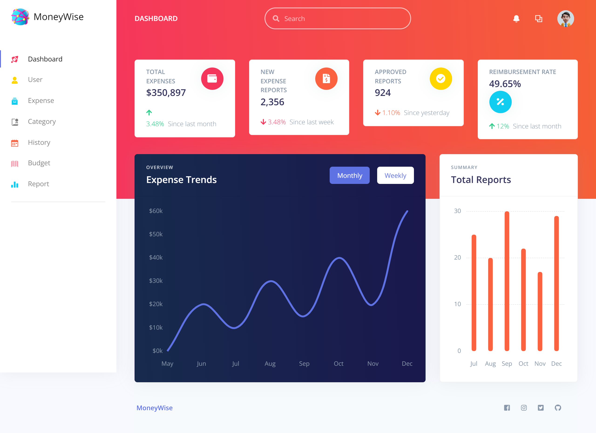
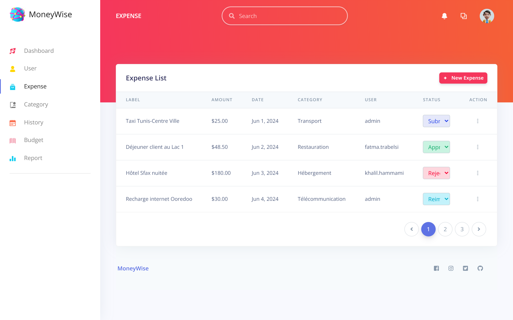

# 💸 MoneyWise - Gestion des Dépenses

Bienvenue sur le dépôt officiel de **MoneyWise**, une application web intelligente développée dans le cadre du projet PDL à l'Université SESAME.  
MoneyWise vous aide à suivre, organiser et analyser vos dépenses de manière **simple, sécurisée et efficace**.  

---

## 🧠 À propos du projet

> _"Ce projet a pour objectif de faciliter le suivi, l'organisation et l’analyse des dépenses grâce à une solution numérique sécurisée et accessible."_  

🎯 La plateforme permet aux utilisateurs de :  
- Gérer leurs **dépenses personnelles ou professionnelles**  
- Visualiser des **statistiques détaillées** 📊  
- Prendre des **décisions financières éclairées**  
- Catégoriser les dépenses 🗂️  
- Exporter les rapports en PDF 📄  
- Utiliser un **tableau de bord interactif** 🖥️  

---

## 🛠️ Technologies utilisées

| Côté Backend | Côté Frontend | Intelligence Artificielle |
|--------------|----------------|---------------------------|
|  |  | 🧠 Implémentation d’algorithmes pour l’analyse des habitudes de dépenses |

---

## 📸 Aperçu

> (Ajoutez ici des captures d’écran de votre dashboard, des graphiques de dépenses, formulaire de saisie, etc.)

---

## 🚀 Lancer le projet localement

### Backend – Spring Boot

```bash
cd backend
./mvnw spring-boot:run


## 🚀 Lancer le projet localement

### ✅ Prérequis

Assurez-vous d’avoir installé les éléments suivants :
- [Java 17+](https://adoptium.net/)
- [Node.js (v16 ou +)](https://nodejs.org/)
- [Angular CLI](https://angular.io/cli)
- [Maven](https://maven.apache.org/)

### 📦 Installation de Node.js & Angular CLI (si non installé)

```bash
# Installer Node.js (Linux/Mac via nvm)
nvm install 18
nvm use 18

# Vérifiez la version installée
node -v
npm -v

# Installer Angular CLI
npm install -g @angular/cli


## 📸 Aperçu

Voici quelques captures d’écran illustrant les principales fonctionnalités de l’application **MoneyWise** :

### 🔐 Authentification avec JWT
Connexion sécurisée via token JWT pour accéder à la plateforme.


---

### 🖥️ Tableau de bord interactif
Vue globale des dépenses, catégories, et statistiques clés.


---

### 📋 Liste des dépenses
Consultation, filtrage, et gestion des dépenses enregistrées.

